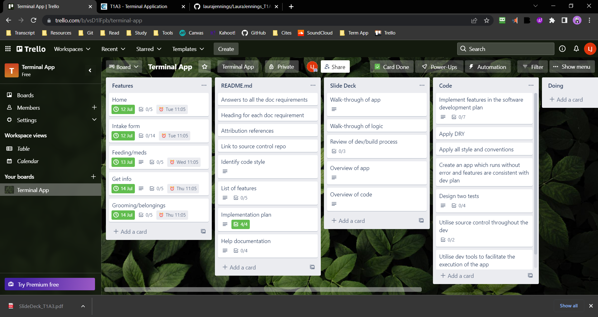
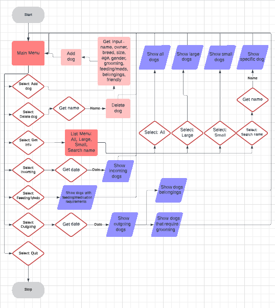

https://github.com/laurajennings/LauraJennings_T1A3

SYSTEM REQUIREMENTS
Python 3
pip modules - simple term menu and sqlite3

STYLE
PEP 8 
Linting: Pylint

FEATURES
1. Add Dog:
Prompts user to enter information about new dog and enters it into the database.
2. Delete Dog:
Prompts user to enter a dog's name to delete it from the database.
3. Get Info:
Displays menu including All, Large, Small or Search name to allow user to get lists of dogs or sepcific dogs information.
4. Feeding/Meds:
Displays list of dogs and their special feeling/medication requierments.
5. Grooming/Belongings:
Displays list of dogs that need to be groomed and dogs with their belongings. 
6. Quit:
Exits out of program. 

IMPLEMENTATION PLAN
The purpose of this app is to take user input and instantiate a class object to store in a database. 
The python module sqlite3 is used to create tables to store data from user.
Add dog:
    - Prompt input from user to instantiate an object to be stored in certain tables.
    - Add objects to additional tables (Large, Small, Feed/meds, Grooming, Belongings) depending on input.
Delete dog:
    - Promput input of dog's name to delete
    - Delete dog from all tables it was added to
Get info:
    - Sub menu with All, Large, Small or Search name
    - Display list of All, Large or Small dogs when selected
    - If search name is selected, get specific dog from table and display all information.
Feeding/Meds:
    - Adds all dogs information to this table
    - Only displays name and feeding/medication info when selected
Grooming/Belongings:
    - Add dogs to grooming table it their input in add dog said yes to grooming
    - Show only dogs who need grooming when selected
    - Adds all dogs to belongings table
    - Displays only names and belongings when selected

INSTALLATION 
This app uses Python 3, pip modules simple_term_menu and sqlite3.
To run, clone from github repo and type in the command line ./run_dogs.sh

HELP
Add Dog:
Fill out dog's information, if non-applicable write None.
Delete Dog:
Type dog's name to delete.
Get Info:
Choose which list to display (All/Large/Small) or select Search Name and type dog's name.
Feeding/Meds:
Displays all dogs and information on their feeding or medication requirements.
Grooming/Belongings:
Displays list of only dogs who require grooming and list of what items belong to what dogs.